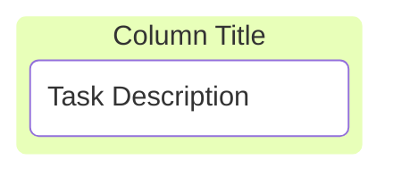
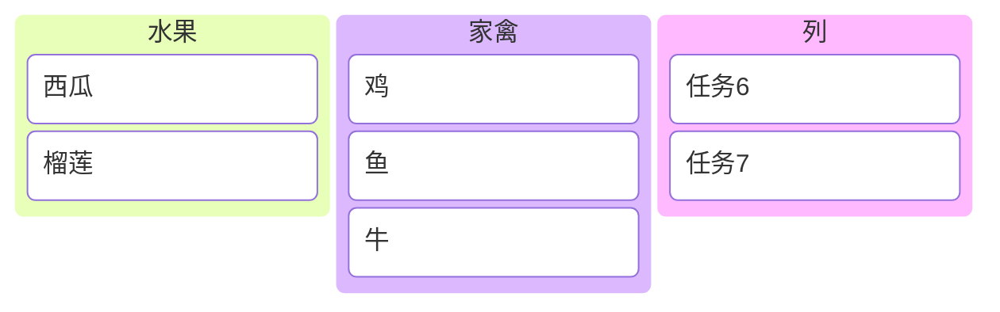
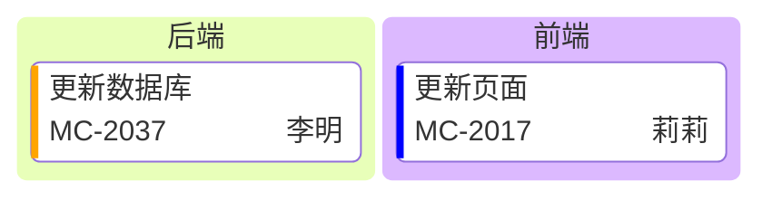
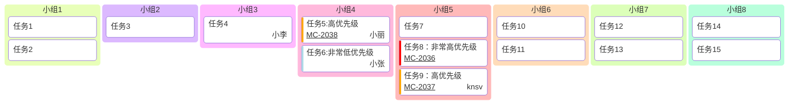
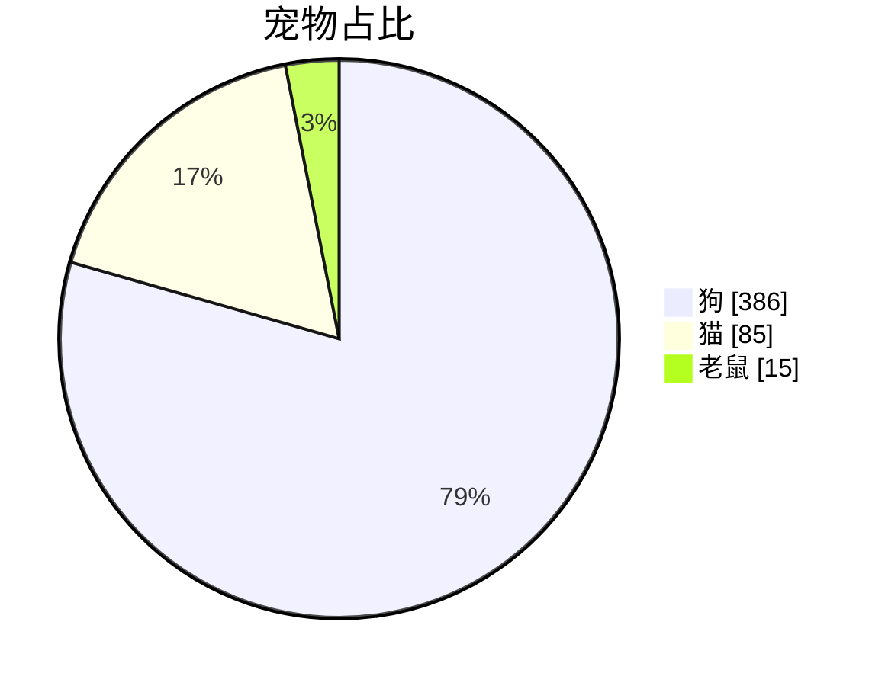
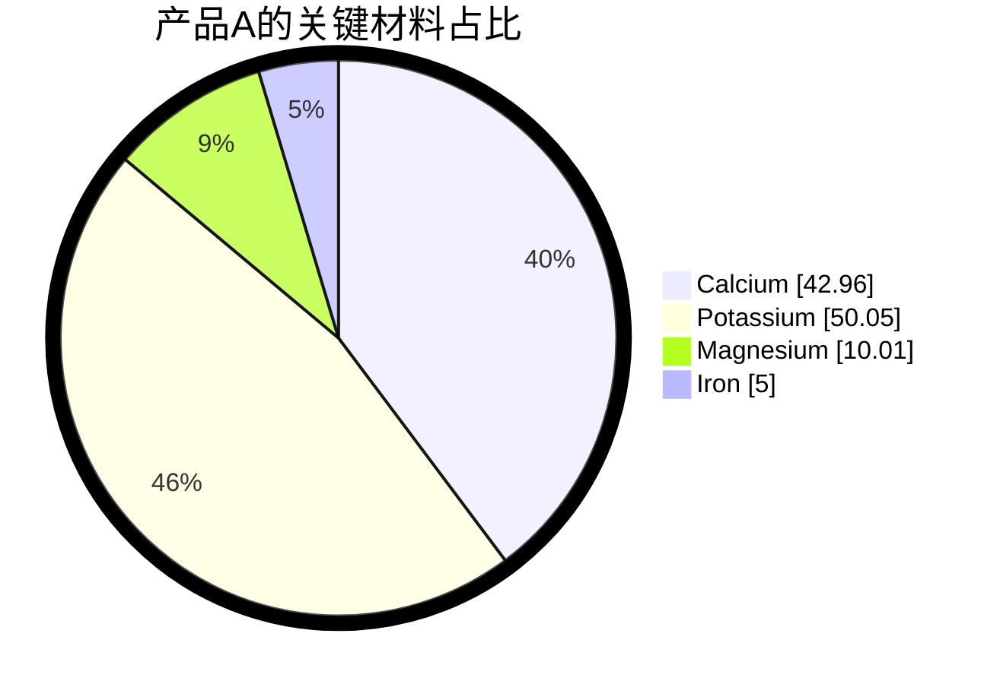
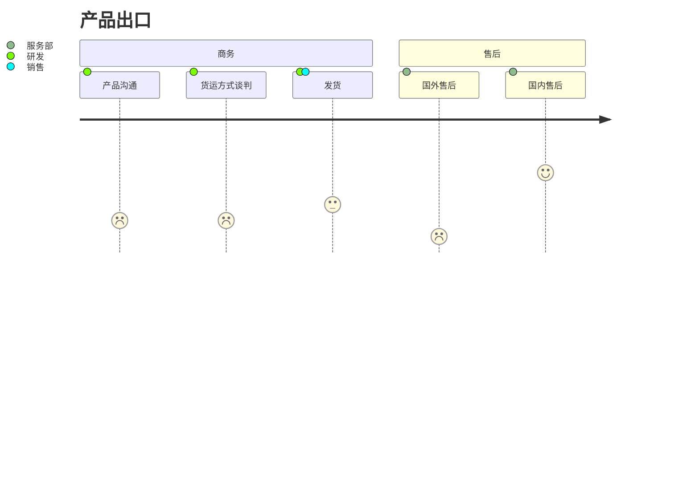
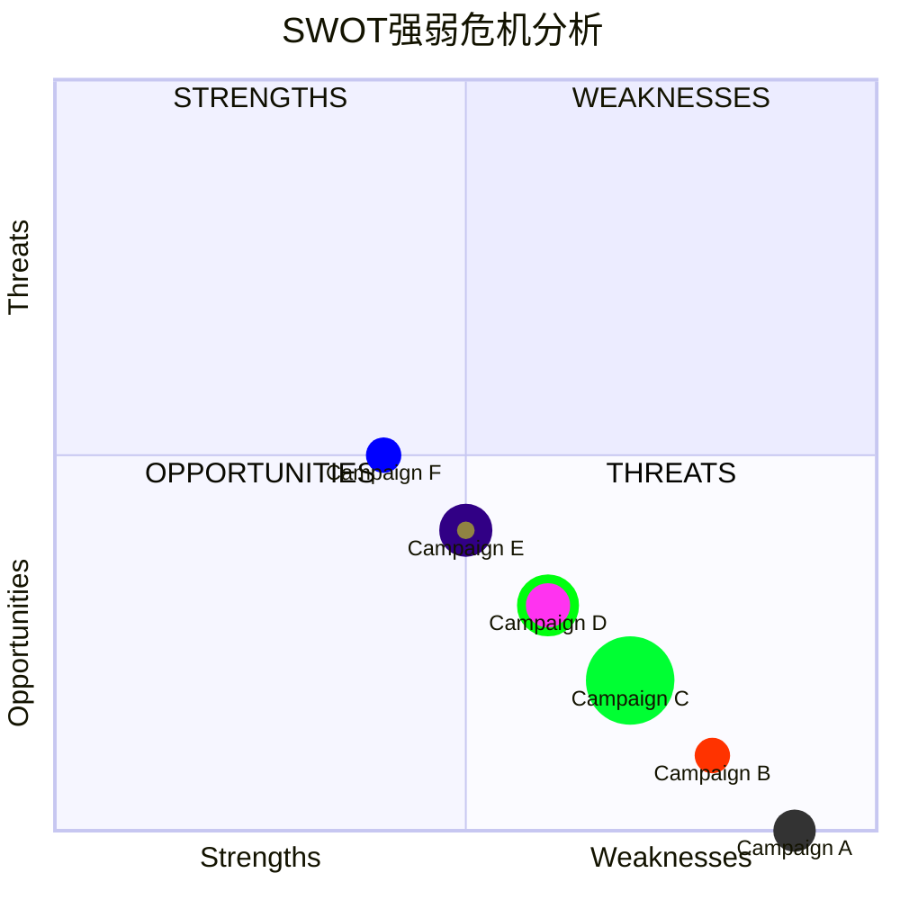
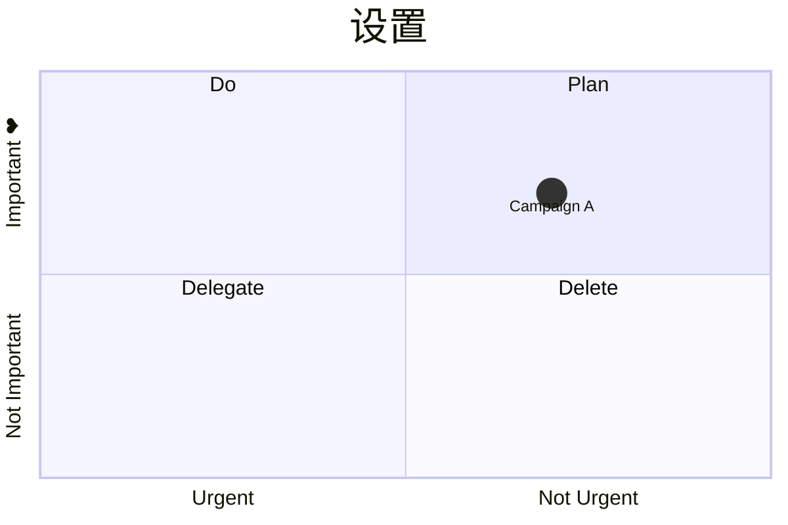

---
tags:
  - Minimal主题
---

# 资料

Mermaid 官方网站介绍它是一个图形和表格的工具：  

```tx
|说明|链接|
|:--:|--|
|官网|https://mermaid.js.org/|
|看板|https://mermaid.js.org/syntax/kanban.html|
|饼图|https://mermaid.js.org/syntax/pie.html|
```


# 与draw.io 配合

很多 Mermaid 的功能， 不是 Obsidian 中都实现了， 这时候可以安装  [draw.io](https://app.diagrams.net/) 。 在 draw.io 中插入 mermaid ：   
![[draw.io中插入marmaid.svg]]
在之后的对话框中，插入 mermaid 代码 ： 
![[输入mermaid代码.svg]]
将 draw.io 文件保存成 `.svg` 格式， 就可以在 obsidian 中引用了 ：   
![[draw.io文件保存成svg格式.svg]]
下图就是一个 draw.io 绘制的 mermaid 旅程图 ： 
![[draw.io绘制的旅程图.svg]]

# [看板](https://mermaid.js.org/syntax/kanban.html)

Mermaid 的看板图以 kanban 关键字开头， 以及列和列中间的内容 ：

````markdown

````

>[!INFO] 代码运行效果
> ```mermaid
> kanban
> 	column1[Column Title]
> 		task1[Task Description]
> ```


## `列`和`任务`

下面展示了如何添加列，并在列下面添加了任务 ： 

````markdown

````


下面是标准语法 ：  

> [!INFO] 任务语法
> columnId[列标题]
> `Tab` taskId[任务描述]


## 元数据

使用 `@{...}` 语法为**任务**添加额外的元数据 ：  


代码：

````markdown

````


## 完整示例

下面提供一个完整实例的看板，看起来非常紧凑 ：   



下面是代码 ，可以在[[Mermaid看板展示.canvas|白板中]]展示，更加美观 ： 

````markdown

````


# [饼图](https://mermaid.js.org/syntax/pie.html)

下面是一个饼图最简单的范例 ： 


下面是源码 ： 

````markdown

````

语法说明：
- 以关键字 `pie` 开始
- `showData` 之后开始渲染，这个关键字是可选的
-  `title` 是饼图的标题

下面范例加粗了一些饼图的边框，百分比在饼图 0.8 的位置 ： 



下面是源码：

````markdown

````


# [旅程图](https://mermaid.js.org/syntax/userJourney.html)

下面是一个用户旅程图的简单范例 ： 

![[draw.io绘制的旅程图.svg]]

在 obsidian 中直接编辑旅程图，存在渲染问题。可以使用 [[Mermaid#与draw.io 配合|draw.io]] ：  

````markdown

````


# [象限图](https://mermaid.nodejs.cn/syntax/quadrantChart.html)

下面是一个象限图的范例，通常用来做 SWOT 分析 ：



````markdown

````

> [!TIP] 提示
> **象限图**里面不能有中文

上面源码中有一个关键词 `classDef` 用来定义类，一个类可以是同一个颜色，圈大小。


## 设置

还可以对这个象限图进行一些设置 ： 



````markdown

````

下面是可用的配置表 ：

| 参数                                | 描述                              | 默认值    |
| --------------------------------- | ------------------------------- | ------ |
| chartWidth                        | 图表的宽度                           | 500    |
| chartHeight                       | 图表的高度                           | 500    |
| titlePadding                      | 标题的顶部和底部填充                      | 10     |
| titleFontSize                     | 标题字体大小                          | 20     |
| quadrantPadding                   | 所有象限外的填充                        | 5      |
| quadrantTextTopPadding            | 当文本绘制在顶部时象限文本顶部填充（那里没有数据点）      | 5      |
| quadrantLabelFontSize             | 象限文本字体大小                        | 16     |
| quadrantInternalBorderStrokeWidth | 象限内的边框描边宽度                      | 1      |
| quadrantExternalBorderStrokeWidth | 象限外边框描边宽度                       | 2      |
| xAxisLabelPadding                 | x 轴文本的顶部和底部填充                   | 5      |
| xAxisLabelFontSize                | X 轴文本字体大小                       | 16     |
| xAxisPosition                     | x 轴的位置（顶部、底部）如果有点，则 x 轴将始终渲染在底部 | 'top'  |
| yAxisLabelPadding                 | y 轴文本的左右填充                      | 5      |
| yAxisLabelFontSize                | Y 轴文本字体大小                       | 16     |
| yAxisPosition                     | y 轴位置（左、右）                      | 'left' |
| pointTextPadding                  | 点和下面文本之间的填充                     | 5      |
| pointLabelFontSize                | 点文本字体大小                         | 12     |
| pointRadius                       | 要绘制的点的半径                        | 5      |


